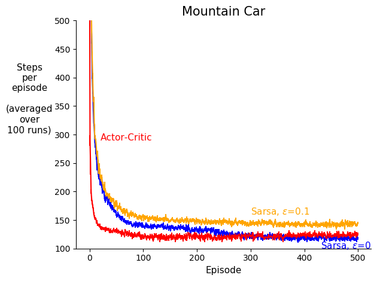

# A study on Policy gradient methods vs. action-value based methods

* This is part of Reinforcement Learning II course project, by Rich Sutton, winter 2020.

This project analyzes and compares action-value based methods vs. policy gradient methods, in a control problem. The project suggests that policy gradient methods should learn faster than action-value based methods under function approximation. More specifically, one-step Sarsa is compared with one-step actor-critic in the Mountain Car environment, where the empirical results were consistent with the original hypothesis.

Learning Rate of one-step actor-critic vs. one-step Sarsa:

